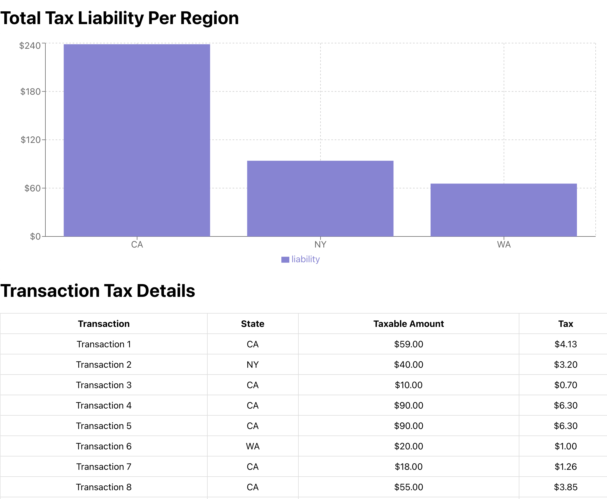

# Transaction App



This project is a web application that calculates and displays tax liabilities. It consists of a backend API built with Python (FastAPI) and a frontend built with React (Typescript).


## Prerequisites

Before you begin, ensure you have the following installed on your MacBook:

- [Python 3.x](https://www.python.org/downloads/)
- [Node.js and npm](https://nodejs.org/)

## Setup

Follow these steps to set up and run the application:

### Backend Setup

1. **Clone the repository**:
    ```sh
    git clone https://github.com/your-repo/transaction-tax-calculator.git
    cd transaction-tax-calculator
    ```

2. **Create a virtual environment**:
    ```sh
    python3 -m venv venv
    ```

3. **Activate the virtual environment**:
    ```sh
    source venv/bin/activate
    ```

4. **Install backend dependencies**:
    ```sh
    pip install -r requirements.txt
    ```

5. **Run the backend server**:
    ```sh
    uvicorn main:app --reload
    ```

### Frontend Setup

1. **Navigate to the `client` directory**:
    ```sh
    cd client
    ```

2. **Install frontend dependencies**:
    ```sh
    npm install
    ```

3. **Start the frontend development server**:
    ```sh
    npm start
    ```

## Running the Application

Open two terminal windows or tabs.

1. In the first terminal, navigate to the project root directory and start the backend server:
    ```sh
    cd transaction-tax-calculator
    source venv/bin/activate
    uvicorn main:app --reload
    ```

2. In the second terminal, navigate to the `client` directory and start the frontend development server:
    ```sh
    cd transaction-tax-calculator/client
    npm start
    ```

The backend server will run on [http://localhost:8000](http://localhost:8000) and the frontend will run on [http://localhost:3000](http://localhost:3000).

## Project Structure

- `main.py`: The entry point for the FastAPI backend.
- `client/`: Contains the React frontend application.
- `package.json`: Lists the JavaScript dependencies for the frontend.